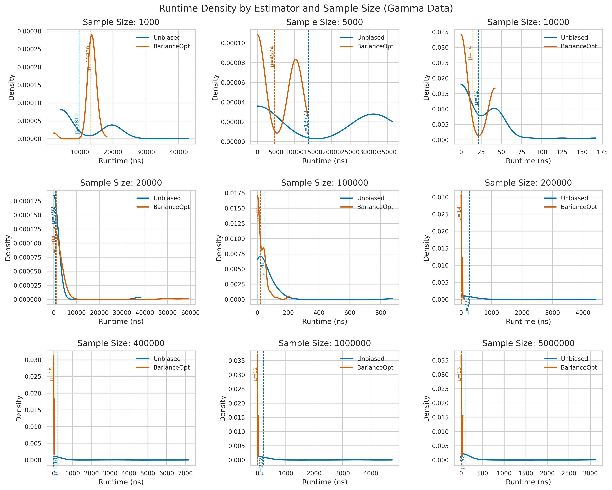
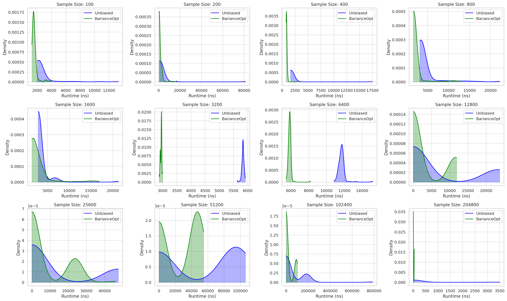
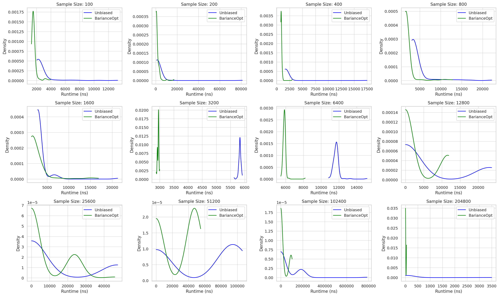
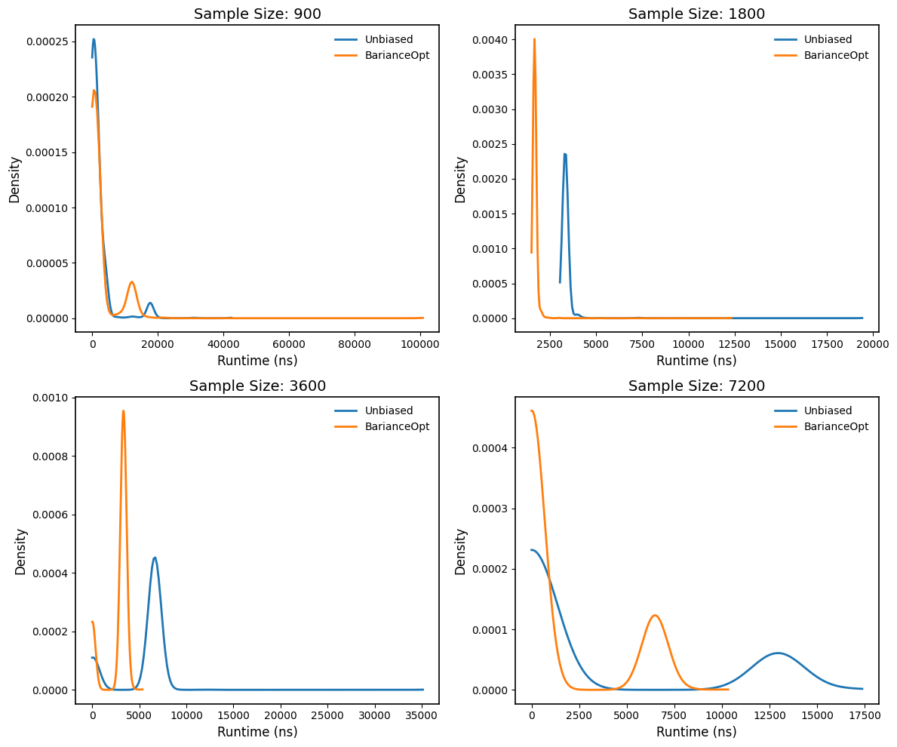
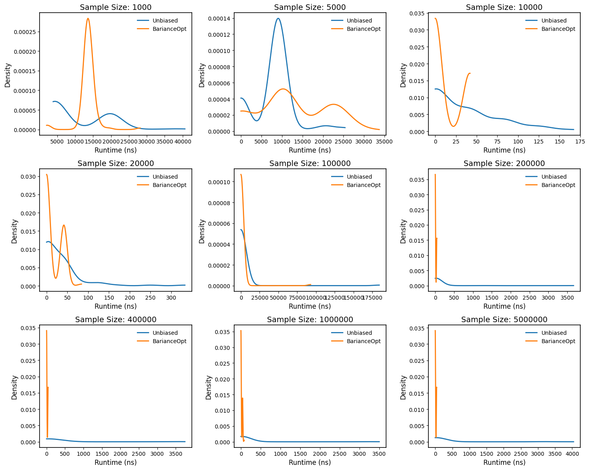

# Bariance and Variance Estimators: Reproduction Repository & Robustness Supplements
Determinist Reproduction of Similar Results as in  https://doi.org/10.48550/arXiv.2503.22333 


This repository contains a Python 3.11 (executed in a virtualized cloud environment) deterministic simulation script for evaluating a family of *a-denominator* based variance estimators. It computes Bias, Variance, and Mean Squared Error (MSE), along with bootstrapped standard errors (SEs) of such [as additional robustness of Ch. 7 in v4], and includes empirical runtime plots to assess the performance of the "bariance" estimator under various data conditions (such as deterministic generated gamma-distributed big-data) in a Local Java SE 21 Environment [as Robustness to Ch. 8 in v4].





**Code**
- `MSEVarEstimsSimulationsWithBootstrapedSEs.py`  
  Main simulation file. Computes Bias, Variance, and MSE for multiple variance estimators using a fixed-seed normal distribution N(0, 1). Outputs bootstrapped confidence intervals. Written in Python 3.11.


**Runtime Figures**


Environment: Java Runtime Benchmark Environment
OS: Mac OS X 13.0
Architecture: aarch64
Java Version: 21.0.1
Available Processors: 10
Max Memory (MB): 4096


- `empRuntimeNormalUnseeded1.png`  
  Runtime comparison under normally distributed data (unseeded, variant 1)



- `empRuntimeNormalUnseeded2.png`  
  Runtime comparison under normally distributed data (unseeded, variant 2)



- `empRuntimeTestSmallNormalUnseeded.png`  
  Small-sample runtime stress test under normal distribution (unseeded)



- `empRuntimeTestBigNormalUnseeded.png`  
  Large-sample runtime stress test under normal distribution (unseeded)



- `runtime_density_gamma_highres_Seeded_with_mean.png`  
  High-resolution runtime density plot under gamma distribution with seeded sampling (42), see code, and mean runtime overlay


**Requirements**

### 🐍 Python

To run the simulation script:

```bash
pip install numpy matplotlib seaborn scipy
```

### Java

SE 21

